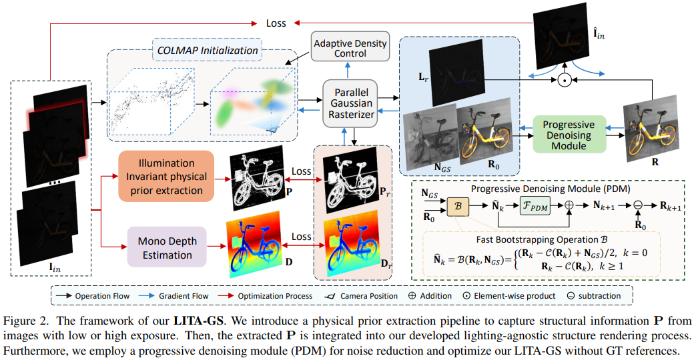

# adaptiveToneCurve

**Scene-Adaptive Nonlinear Tone Curves for Pseudo Ground-Truth Generation in Low-Light 3D Gaussian Splatting**

Mingzhe Lyu, Jinqiang Cui, Hong Zhang

Paper (coming soon) | [Code](https://github.com/lvmingzhe/adaptiveToneCurve)

This repository provides a **drop-in replacement** for the linear pseudo ground-truth generation in [LITA-GS](https://github.com/LowLightGS/LITA-GS) (CVPR 2025). We introduce two scene-adaptive nonlinear tone curves --- Adaptive SoftExp (ASE) and Adaptive Poly3 (AP3) --- that leverage per-frame percentile luminance statistics to produce higher-quality pseudo supervision for low-light 3D Gaussian Splatting.

---

## Overview

<p align="center">
  
</p>

Low-light novel view synthesis pipelines rely on pseudo ground-truth images derived from underexposed inputs to supervise 3D Gaussian Splatting. The original LITA-GS uses a linear brightness scaling, which loses highlight detail and introduces saturation artifacts. We propose nonlinear tone curves with a scene-adaptive offset term:

- **ASE (Adaptive SoftExp):** A soft-exponential mapping with a percentile-driven offset that lifts shadow detail while preserving highlight structure.
- **AP3 (Adaptive Poly3):** A third-order polynomial curve whose free coefficients and adaptive offset jointly maximize PSNR on the target scene distribution.

Both curves share two fixed hyperparameters (alpha = 0.12, beta = 2.5) across all benchmarks, with only the constant offset `c` adapted per dataset regime.

---

## Key Results

Mean metrics across all scenes per benchmark. Best in **bold**.

| Benchmark | Method | PSNR (dB) | SSIM | LPIPS |
|:---|:---|:---:|:---:|:---:|
| LOM (5 scenes, 5K iter) | LITA-GS (linear) | 20.09 | .810 | .258 |
| | ASE (c=3) | 24.26 | **.850** | .257 |
| | **AP3 (c=1)** | **24.43** | .848 | **.243** |
| RealX3D NVS (9 scenes, 15K iter) | LITA-GS (linear) | 15.25 | .512 | .455 |
| | ASE (c=4) | 17.82 | .652 | .419 |
| | **AP3 (c=2)** | **18.50** | **.658** | **.417** |
| MipNeRF360-varying (7 scenes, 15K iter) | LITA-GS (linear) | 16.16 | .569 | .398 |
| | **ASE (c=0)** | **17.95** | **.595** | **.363** |
| | AP3 (c=0) | 17.08 | .579 | .386 |

Improvements over the linear baseline: up to **+4.34 dB** on LOM and **+3.25 dB** on RealX3D.

---

## Setup

Tested environment: Python 3.9, CUDA 12.x, PyTorch 2.x.

```bash
# Create conda environment
conda create -n adaptiveToneCurve python=3.9 -y
conda activate adaptiveToneCurve

# Install PyTorch (adjust CUDA version as needed)
pip install torch torchvision --index-url https://download.pytorch.org/whl/cu121

# Install dependencies
pip install plyfile tqdm Pillow scipy lpips tensorboard

# Build submodules
pip install submodules/diff-gaussian-rasterization
pip install submodules/simple-knn
```

---

## Data Preparation

### LOM Dataset

The LOM dataset (5 indoor scenes) is from [Aleth-NeRF](https://github.com/cuiziteng/Aleth-NeRF) (Cui et al., AAAI 2024). Follow their COLMAP preprocessing pipeline with the default brightness adjustment to obtain the low-light / normal-light image pairs and camera poses.

### RealX3D Dataset

The RealX3D dataset (9 scenes) is from [RealX3D](link) (cite accordingly). Download the dataset following the instructions in the original paper.

### MipNeRF360-varying

The MipNeRF360 dataset is from [Barron et al. (CVPR 2022)](https://jonbarron.info/mipnerf360/). For the varying-exposure setup, we simulate exposure variation by applying per-image gamma darkening to create low-light training inputs, while keeping the original images as ground truth for evaluation.

### Depth and Structure Prior Extraction

Monocular depth maps and color-invariant structure priors are required as input features:

- **Depth extraction:** See `Depth Extraction/` for the Marigold-based depth estimation pipeline and environment setup.
- **Structure priors:** See `Structure Prior Extraction/` for the CIConv-based prior extraction script.

Organize each scene directory as:

```
<scene>/
  images/          # ground-truth (normal-light) images
  images_low/      # low-light input images
  sparse/0/        # COLMAP reconstruction
  depth/           # extracted monocular depth maps
  prior/           # extracted structure priors
```

---

## Training

### Basic Command

```bash
python train_underexposed.py \
    -s <data_path> \
    -m <output_path> \
    --config <config_file>
```

### Pseudo Ground-Truth Mode Selection

The `--pseudo_gt_mode` flag controls pseudo-GT generation:

| Mode | Description |
|:---|:---|
| `mean_hard` | Linear scaling (LITA-GS default) |
| `adaptive_softexp` | Adaptive SoftExp (ASE) |
| `adaptive_poly3` | Adaptive Poly3 (AP3) |
| `fitted_curve` | Fixed parametric curve (requires `--curve_variant`) |

### Per-Dataset Configuration Examples

**LOM** (e.g., bike scene):

```bash
python train_underexposed.py \
    -s /path/to/LOM/bike \
    -m output/LOM_bike_ase \
    --pseudo_gt_mode adaptive_softexp \
    --sigmoid_alpha 0.12 \
    --sigmoid_beta 2.5 \
    --iterations 5000 \
    --config arguments/LOM/bike_low.py
```

**RealX3D** (e.g., Popcorn scene):

```bash
python train_underexposed.py \
    -s /path/to/RealX3D/Popcorn \
    -m output/RealX3D_popcorn_ap3 \
    --pseudo_gt_mode adaptive_poly3 \
    --sigmoid_alpha 0.12 \
    --sigmoid_beta 2.5 \
    --iterations 15000 \
    --config arguments/Popcorn/popcorn.py
```

**MipNeRF360-varying** (e.g., bicycle scene):

```bash
python train_underexposed.py \
    -s /path/to/mipnerf360/bicycle \
    -m output/mip360v_bicycle_ase \
    --pseudo_gt_mode adaptive_softexp \
    --sigmoid_alpha 0.12 \
    --sigmoid_beta 2.5 \
    --iterations 15000
```

### Key Hyperparameters

| Parameter | Default | Description |
|:---|:---:|:---|
| `--sigmoid_alpha` | 0.12 | Offset magnitude (fixed across all benchmarks) |
| `--sigmoid_beta` | 2.5 | Offset decay exponent (fixed across all benchmarks) |
| `--pseudo_gt_mode` | `mean_hard` | Tone curve selection |
| `--lambda_dssim_low` | 0.2 | DSSIM loss weight on low-light input |
| `--lambda_depth` | 0.1 | Depth supervision weight |
| `--lambda_prior` | 0.01 | Structure prior loss weight |
| `--iterations` | 30000 | Total training iterations |

The offset is computed as: `offset = alpha * (1 - r)^beta`, where `r` is the per-frame 90th-percentile luminance ratio. The parameters `alpha` and `beta` are fixed at 0.12 and 2.5 respectively across all three benchmarks; only the constant `c` is adapted per dataset regime.

---

## Citation

If you find this work useful, please cite both this paper and the original LITA-GS:

```bibtex
@article{lyu2025adaptivetonecurve,
    title={Scene-Adaptive Nonlinear Tone Curves for Pseudo Ground-Truth Generation in Low-Light 3D Gaussian Splatting},
    author={Lyu, Mingzhe and Cui, Jinqiang and Zhang, Hong},
    journal={The Visual Computer (under review)},
    year={2025}
}

@inproceedings{zhou2025litags,
    title={LITA-GS: Illumination-Agnostic Novel View Synthesis via Reference-Free 3D Gaussian Splatting and Physical Priors},
    author={Zhou, Han and Dong, Wei and Chen, Jun},
    booktitle={Proceedings of the IEEE/CVF Conference on Computer Vision and Pattern Recognition (CVPR)},
    year={2025}
}
```

---

## Acknowledgements

This codebase is built on top of [LITA-GS](https://github.com/LowLevelAI/LITA-GS) (CVPR 2025) by Zhou et al. We thank the authors for making their code publicly available.

---

## License

This project is released under the [Apache License 2.0](LICENSE).
